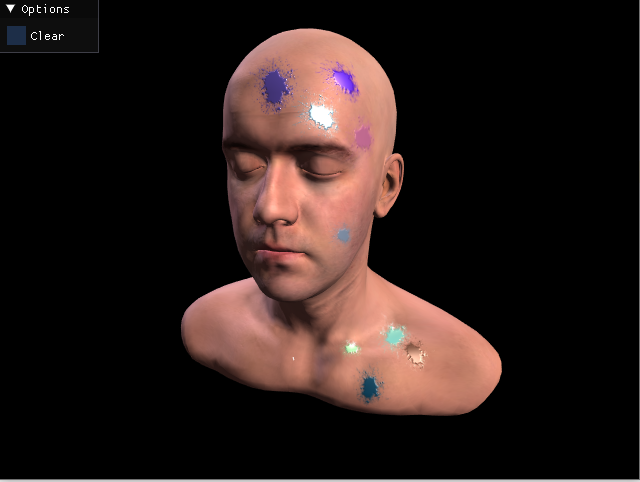

## threepp (Work in progress)

Cross-platform C++17 port of the popular Javascript 3D library [three.js](https://github.com/mrdoob/three.js/) [r129](https://github.com/mrdoob/three.js/tree/r129).


#### Current state of the project

Most of the core library has been ported, including advanced rendering capabilities, 
however much remains to be done..

##### What works?

* Box, Sphere, Plane, Cylindrical, Capsule and Tube geometries  
* 2D Textures, Sprites, RenderTarget
* Transparency, Shadows
* OrbitControls
* Ambient, Directional, Point, Spot and Hemi lights
* Line, Points, Mesh, InstancedMesh
* Water and Sky shader
* Raycasting [Mesh, Line, Points]
* Binary STL loader
* OBJ/MTL Loader
* Generic model loader based on [Assimp](https://github.com/assimp/assimp)
* Easy integration with [Dear ImGui](https://github.com/ocornut/imgui)
* Easy integration with [Bullet](https://github.com/bulletphysics/bullet3)
* Easy to use text rendering using [glText](https://github.com/vallentin/glText)

Builds on Windows, Linux, MacOS, MinGW.

### But, but why?

Because fun. 


### How to build

`threepp` can be used in conjunction with both `vcpkg` and `conan`.

#### vcpkg (using manifest mode)

Call CMake with `-DCMAKE_TOOLCHAIN_FILE=[path to vcpkg]/scripts/buildsystems/vcpkg.cmake`

Add optional features by listing them with `-DVCPKG_MANIFEST_FEATURES=feature1;feature2`

See [vcpkg.json](vcpkg.json) for available features.

###### Building under MinGW

Under MinGW you'll need to specify the vcpkg triplet:
```shell
-DVCPKG_TARGET_TRIPLET=x64-mingw-[static|dynamic]  # choose either `static` or `dynamic`.
-DVCPKG_HOST_TRIPLET=x64-mingw-[static|dynamic]    # needed only if MSVC cannot be found. 
```

#### conan 1.x

Run something akin to:
`conan install . -s build_type=Debug -if cmake-build-debug -b missing` _before_ calling CMake.
You might also use the supplied `run_conan_XXX.sh` scripts.


### Implementation notes

In general, you'll find that math classes are value types, while `threepp` expect smart pointers for other types. 
For convenience, geometries, materials etc. has a static `::create` function that returns a `std::shared_ptr`.
There should never be a need to handle memory explicitly using `threepp`. Yay!

### Example

```cpp
#include "threepp/threepp.hpp"

using namespace threepp;

int main() {

    Canvas canvas;
    GLRenderer renderer{canvas};

    auto scene = Scene::create();
    auto camera = PerspectiveCamera::create(75, canvas.getAspect(), 0.1f, 100);
    camera->position.z = 5;
    
    OrbitControls controls{camera, canvas};

    auto light = AmbientLight::create(Color(0xffffff).multiplyScalar(0.75f));
    scene->add(light);

    auto group = Group::create();

    {
        const auto boxGeometry = BoxGeometry::create();
        const auto boxMaterial = MeshPhongMaterial::create();
        boxMaterial->color = Color::red;
        auto box = Mesh::create(boxGeometry, boxMaterial);
        box->position.x = -1;
        group->add(box);
    }

    {
        const auto boxGeometry = BoxGeometry::create();
        const auto boxMaterial = MeshPhongMaterial::create();
        boxMaterial->color = Color::green;
        auto box = Mesh::create(boxGeometry, boxMaterial);
        box->position.x = 1;
        group->add(box);
    }

    scene->add(group);

    const auto planeGeometry = PlaneGeometry::create(5, 5);
    const auto planeMaterial = MeshLambertMaterial::create();
    planeMaterial->color = Color::gray;
    planeMaterial->side = DoubleSide;
    auto plane = Mesh::create(planeGeometry, planeMaterial);
    plane->position.y = -1;
    plane->rotateX(math::degToRad(90));
    scene->add(plane);

    canvas.onWindowResize([&](WindowSize size) {
        camera->aspect = size.getAspect();
        camera->updateProjectionMatrix();
        renderer.setSize(size);
    });
    
    canvas.animate([&](float dt) {
        group->rotation.y += 0.5f * dt;

        renderer.render(scene, camera);
    });
}

```

## Consuming threepp using a custom vcpkg-registry

See [here](tests/threepp_vcpkg_test) for an example of how `threepp` may be consumed 
as a library a separate project using vcpkg.

### Screenshots



